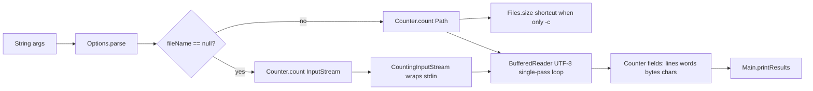

# Repository Guidelines

## Project Overview
`ccwc` ("Coding Challenges Word Count") is a Java clone of the Unix `wc` command, built for the [Coding Challenges "Build Your Own wc Tool"](https://codingchallenges.fyi/challenges/challenge-wc) exercise. It counts bytes (`-c`), lines (`-l`), words (`-w`), and characters (`-m`) in a file or from stdin. No flags defaults to `-c -l -w` (bytes+lines+words), matching real `wc`. Core design goal: memory-safe single-pass streaming so it scales to files larger than available RAM, rather than loading input into memory.

## Architecture & Data Flow
Four classes, all in package `ccwc`, all under `src/ccwc/`. Pure JDK — no third-party libraries, no `java.util` collections anywhere.

Call flow from `Main.main` (`src/ccwc/Main.java:16`):
1. `Options.parse(args)` (`Options.java:31`) turns argv into an `Options` DTO: four public `boolean` flags (`countBytes`, `countLines`, `countWords`, `countChars`) plus `fileName`. The first non-flag argument becomes `fileName` (`Options.java:39-43`); further non-flag arguments are silently dropped, and unrecognized flags are silently treated as a filename candidate too (no validation/error path). If no flag was set at all, `countBytes`/`countLines`/`countWords` are turned on — deliberately **not** `countChars` (`Options.java:47-52`), matching real `wc`'s default.
2. `Main` branches on `opts.fileName == null` (`Main.java:20`): stdin → `Counter.count(InputStream, Options)` (`Counter.java:66`); file → `Counter.count(Path, Options)` (`Counter.java:37`).
3. `Counter` accumulates results into four public `long` fields (`lines`, `words`, `bytes`, `chars`), reset to `0` at the start of every `count()` call (`Counter.java:38`, `:67`) — the object is reusable but destructive/stateful, not safe for concurrent use.
4. `Main.printResults` (`Main.java:42`) formats output: the classic aligned `"%8d %8d %8d %s\n"` columnar format only when exactly `-c -l -w` are active and `-m` is not (`Main.java:45-46`); otherwise one metric per line via `println`, one `if` block per flag (`Main.java:47-60`).

**Single-pass streaming is the central design decision.** Lines/words/chars are all derived from one loop, `while ((ch = reader.read()) != -1)`, over a `BufferedReader(InputStreamReader(in, StandardCharsets.UTF_8))` (`Counter.java:97-120`) — each decoded char is inspected once for newline (`ch == '\n'`), word-boundary (`Character.isWhitespace(ch)`, Unicode-aware, not just ASCII), and char-count, all in the same iteration (`Counter.java:104-119`). Byte counting normally can't ride along in that loop (the reader consumes decoded chars, not raw bytes), so when bytes must be counted from a stream, `Counter` wraps the raw `InputStream` in `CountingInputStream` — a `FilterInputStream` decorator (`CountingInputStream.java:12`) — *underneath* the reader (`Counter.java:78`), tallying bytes as they're consumed. Still one physical read pass.

Two shortcuts skip the full read entirely:
- File + `-c` only → `bytes = Files.size(path)` (`Counter.java:41`), zero bytes actually read. Note: if `-c` is combined with any of `-l`/`-w`/`-m` on a file, the code both stats the file for size *and* streams it for the other metrics (`Counter.java:40-49`) — two filesystem operations, not a bug but not optimal.
- Stdin + `-c` only → raw 8 KB-buffer byte loop (`Counter.java:69-76`), no UTF-8 decoding, no `CountingInputStream` involved.



## Key Directories
- `src/ccwc/` — all source, 4 files, package `ccwc`. Flat, no sub-packages, no test source root declared anywhere.
- `out/ccwc/` — `javac`/IntelliJ compiler output, mirrors `src/ccwc/` 1:1 (`Main.class`, `Options.class`, `Counter.class`, `CountingInputStream.class`). Gitignored, fully regenerated by every build — never hand-edit or commit anything under `out/`.
- `.idea/` + `ccwc.iml` (repo root) — IntelliJ project metadata; see Runtime/Tooling Preferences below. Only `.idea/misc.xml`, `.idea/modules.xml`, `.idea/vcs.xml` are tracked in git; `.idea/workspace.xml` and `.idea/shelf/` are user-local and gitignored (via `.idea/.gitignore`).
- `.github/workflows/ci.yml` + `.github/scripts/smoke-test.sh` — GitHub Actions CI (see Testing & QA). Repo root docs (`README.md`, `CLAUDE.md`, this file) and manual sample-input fixtures (`test.txt`, `test2.txt`). No `tests/` directory, no test source root anywhere.

## Development Commands
No build tool — plain `javac`/`java`, run every command from the repo root.

```bash
# Compile (mirrors what IntelliJ's own build does)
javac -d out src/ccwc/*.java

# Run against a file
java -cp out ccwc.Main -l test.txt

# Run against stdin
cat test.txt | java -cp out ccwc.Main -w

# Windows cmd.exe — avoids PowerShell's BOM-stripping `cat` alias (see Runtime/Tooling Preferences)
type test.txt | java -cp out ccwc.Main -c
```
That's the complete workflow — there is no lint step, no formatter, no packaging/release step. Flags: `-c` bytes, `-l` lines, `-w` words, `-m` characters; no flags defaults to `-c -l -w`. The first non-flag argument is the filename; if omitted, input is read from stdin.

## Code Conventions & Common Patterns
- **Formatting**: standard Java style — 4-space indents, opening braces on the same line, full Javadoc (`/** … */`) on every public class/field/method including `@param`/`@return`/`@throws`. Match this exactly for any new public member.
- **Naming**: camelCase throughout. Abbreviated names for widely-scoped DTO variables (`opts`), full words elsewhere (`counter`, `bytesRead`). Boolean flags are prefixed `count*` (`countBytes`, `countLines`, `countWords`, `countChars`).
- **State management**: flat DTOs with **public mutable fields, no getters/setters, no builders, no immutability** — `Options` (flags + filename) and `Counter` (result counts) are both plain data holders read directly by callers, e.g. `Main.printResults` reads `counter.lines` / `counter.bytes` straight off the field (`Main.java:46,49,52,55,58`). `Counter`'s fields are reset at the top of `count()` (`Counter.java:38,67`) rather than the object being recreated — carry this pattern forward rather than introducing immutable value objects.
- **Object creation / no DI**: no dependency-injection framework or container of any kind. Dependencies are wired with plain `new` at the point of use (`new Counter()` — `Main.java:18`; `new CountingInputStream(in)` — `Counter.java:78`) or via a **static factory** instead of a constructor for parsing: `Options.parse(String[] args)` (`Options.java:31`), not `new Options(args)`. Follow the static-factory convention for any new "build me an X from raw input" need.
- **Decorator pattern** for cross-cutting byte counting: `CountingInputStream extends FilterInputStream`, overriding both `read()` (`CountingInputStream.java:33`) and `read(byte[], int, int)` (`CountingInputStream.java:54`), always delegating to `super.read(...)` first and only incrementing the counter when the result isn't `-1`. This is the pattern to copy if another transparent stream-tap is ever needed (e.g. hashing, progress tracking).
- **Error handling**: checked exceptions propagate, they are never caught-and-handled. Every method up the call chain declares `throws IOException` and lets it bubble all the way to the JVM — `main` itself declares `throws IOException` (`Main.java:16`) and there is no error-message/exit-code layer; a missing file surfaces as a raw stack trace. Resource cleanup is done exclusively via try-with-resources (`Counter.java:46-48`, `98-99`), never a manual `close()` in a `finally`. Don't add a `catch` that swallows `IOException` — if you need friendlier error output, that's new scope, wire it consistently through `main`, not ad hoc inside `Counter`.
- **Async patterns**: none. Everything is synchronous, single-threaded, blocking I/O — no `Thread`, `ExecutorService`, or `CompletableFuture` anywhere in the codebase. Keep new code synchronous unless there's a specific reason to change that (and treat that as a deliberate, separate design decision, not an incidental addition).
- **Flag parsing**: a `switch` on string literals maps `-c`/`-l`/`-w`/`-m` to fields (`Options.java:34-38`); the `default` case silently captures the first non-flag argument as the filename and drops everything else without any validation or error message (`Options.java:39-43`).
- **Explicit UTF-8, always**: charset is never left to the platform default — `StandardCharsets.UTF_8` is passed explicitly wherever bytes become chars (`Counter.java:99`). Match this in any new stream-decoding code; never rely on the platform default charset.
- **Verified current output quirks** (compiled and ran the exact source in an isolated scratch dir to confirm — this supersedes `CLAUDE.md`'s older "Known gotcha" wording, which claims stdin output literally prints the word `null`; that is **not** what the current code does): when reading from **stdin**, `Main.java:43` computes `suffix = fileName == null ? "" : fileName`, so `suffix` is an empty string, never the literal text `"null"`. The real, verified defects are (a) a **trailing space** before the line ends in every output branch when `suffix` is empty (e.g. `4 ` instead of `4`), present in both the columnar branch and the per-metric branch equally; and (b) a **line-terminator inconsistency**: the columnar default branch (`Main.java:46`) always emits a literal `\n` from the `printf` format string, while every individual-metric branch (`Main.java:49,52,55,58`) uses `println`, which appends the JVM's platform line separator (`\r\n` on Windows) — so on Windows, default-format output and per-metric output end their lines differently. Don't copy either inconsistency into new output code; if you touch `printResults`, fix the suffix/trailing-space handling and standardize the line terminator in the same change.
- **No multi-file support**: real `wc` accepts multiple filenames and prints a totals line; this implementation only ever takes the first non-flag argument as a filename (`Options.java:39-43`, `Main.java:20-27`) — additional filenames are silently ignored, there's no totals row.

## Important Files
- `src/ccwc/Main.java` — entry point; `main` (`:16`) and output formatting `printResults` (`:42`).
- `src/ccwc/Options.java` — CLI flag/filename parsing, `Options.parse` (`:31`).
- `src/ccwc/Counter.java` — counting engine; `count(Path, …)` (`:37`), `count(InputStream, …)` (`:66`), single-pass loop in private `countFromStream` (`:97`).
- `src/ccwc/CountingInputStream.java` — byte-counting stream decorator, used only when stdin needs both a byte count and at least one of line/word/char count simultaneously.
- `.idea/misc.xml` — authoritative JDK/language-level declaration (`languageLevel="JDK_24"`, `project-jdk-name="openjdk-24"`) and compiler output path (`out/`).
- `ccwc.iml` — module definition; single source root `src/` (`isTestSource="false"`), no test source root, inherits JDK and output path from `.idea/misc.xml`.
- `README.md` — user-facing usage/build docs, flag examples with expected output numbers, and the PowerShell BOM-stripping gotcha (lines 140-150).
- `CLAUDE.md` — earlier AI-assistant guidance covering similar architecture/build ground as this file. Its "Known gotcha" section is stale (see the Code Conventions note above) — treat this `AGENTS.md` as canonical where the two disagree.
- `test.txt` — 7146-line / 342190-byte UTF-8-with-BOM sample fixture (Project Gutenberg's *The Art of War*) used in every README usage example; **not** an automated test, just sample input. `test2.txt` — a second, unreferenced 165-line/13.0 KB sample file (a YouTube script draft), not mentioned anywhere in source or docs.

## Runtime/Tooling Preferences
- **JDK 24** (`openjdk-24`, language level `JDK_24`) per `.idea/misc.xml:3` — treat this as the authoritative target version. `README.md` advertises a looser "JDK 17+" minimum; any modern JDK 17+ does compile the code, but match JDK 24 conventions/APIs when in doubt, and don't rely on anything newer than 24.
- **No package manager, no dependency manifest** — confirmed repo-wide absent: no `pom.xml` (Maven), no `build.gradle`/`build.gradle.kts` (Gradle), no `package.json` (npm), no `Makefile`, no `CMakeLists.txt`. The project is intentionally zero-dependency, pure JDK (`java.io` + `java.nio.file` + `java.nio.charset` only). Do not introduce a build tool or third-party dependency without that being an explicit, separate ask.
- **IntelliJ IDEA project** (`ccwc.iml` + `.idea/`), single module, single source root (`src/`). Compile output goes to `out/` (gitignored, regenerated every build). If project settings need to change, edit the tracked `.idea/misc.xml` / `.idea/modules.xml` / `.idea/vcs.xml` — never `.idea/workspace.xml` (user-local, gitignored, not shared).
- **Windows/PowerShell cross-platform note**: PowerShell's `cat`/`Get-Content` strips the UTF-8 BOM before piping to `java.exe`, causing a 3-byte discrepancy in stdin `-c` byte counts versus reading the same file directly. Use `cmd.exe`'s `type` or Git Bash's `cat` instead when verifying stdin byte counts on Windows (`README.md:140-150`). Separately (verified by direct testing, not documented anywhere before this file), `println`-based output lines end with `\r\n` on Windows while the columnar `printf` branch always ends with a literal `\n` — see the Code Conventions note above.

## Testing & QA
There is still no unit-test framework (confirmed zero matches repo-wide for `junit|testng|mockito|@Test`) and `ccwc.iml` declares no test source root — this remains a deliberate gap, not something to "fix" as a side effect of an unrelated change; adding real unit tests is new scope.

There **is** CI: `.github/workflows/ci.yml` runs on every push to `master` (the repo's actual default branch — verify with `git ls-remote --symref origin HEAD` if that ever changes) and every PR, on a 2×2 matrix (`ubuntu-latest`/`windows-latest` × JDK `17`/`24` via Temurin — deliberately spanning README's claimed "17+" floor and `.idea/misc.xml`'s configured `24`, and both OSes since `Main.java`'s output has a verified Windows-specific `\r\n`-vs-`\n` quirk, see Code Conventions). Each job compiles (`javac -d out src/ccwc/*.java`) then runs `.github/scripts/smoke-test.sh`, which turns the manual checks below into automated assertions — 12 checks covering every distinct branch in `Counter` (the `Files.size` shortcut, the raw-byte stdin shortcut, the `CountingInputStream` decorator path, and both the columnar and per-metric output branches, for both file and stdin input). This is whole-program/CLI-level coverage driven by `test.txt`, not per-class unit tests.

To verify a change locally, compile then either run the smoke-test script or repeat its checks by hand — both compare against the same values documented in `README.md`:
```bash
javac -d out src/ccwc/*.java
bash .github/scripts/smoke-test.sh      # automated: all 12 checks, exits non-zero on any mismatch

# equivalent by hand, one flag at a time:
java -cp out ccwc.Main -c test.txt   # expect 342190
java -cp out ccwc.Main -l test.txt   # expect 7145
java -cp out ccwc.Main -w test.txt   # expect 58164
java -cp out ccwc.Main -m test.txt   # expect 339292
java -cp out ccwc.Main test.txt      # expect "    7145    58164   342190 test.txt"
```
`test.txt` / `test2.txt` are sample input fixtures the smoke test happens to assert against, not a hand-written test corpus — there's still no per-class edge-case coverage (empty input, unknown flags, multi-byte UTF-8 boundaries). When changing anything in `Counter` or `CountingInputStream`, run `smoke-test.sh` (or let CI run it on the PR) and confirm all 12 checks pass before considering the change done.
